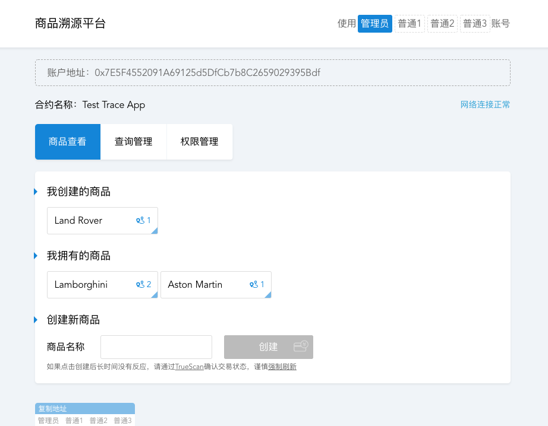

# DApp开发文档

> 2018/11/08 @felix

## 什么是DApp

DApp是去中心化应用（Decentralized Applications）的简称。相比于传统的各个平台的互联网应用（App），去中心化应用的全部或者部分逻辑需要在区块链（主要是公链）上完成，因此应用的一部分功能会拥有区块链网络的公开透明、安全、不可篡改等优势。其中在区块链网络中执行的逻辑以智能合约（Smart Contract）的形式保存在链上。

早期的DApp主要以金融产品和相关的小游戏为主，受限于以太坊（第一条可以支持智能合约的2.0公链）的处理性能和较高的交易手续费（Gas），这些早起的DApp只能在链上承载一些简单的业务逻辑如转账。

随着更高性能和更低交易成本的3.0公链出现，DApp的合约层可以更加强壮、高效，承载更复杂的业务逻辑，继而实现功能更加丰富的DApp。

## DApp的组成

### 智能合约

智能合约是DApp的灵魂，所有在智能合约里处理的逻辑都是公开透明、不可篡改的。但是目前智能合约相比传统互联网应用的底层服务，其处理性能还不足以实现所有功能；同时链上的数据储存也是需要大量成本的，因此智能合约也不适合简单粗暴的数据存储功能。例如：对于金融相关的DApp，通常使用智能合约来完成财产的记录、转账等核心功能，而不会关心复杂的开户人的身份等信息，因此产生了一个匿名、安全、公开的金融市场。而对于未来的更多场景下的DApp，可预见地，短期内智能合约主要会用来做应用关键数据的存在性证明或者所属权证明，例如游戏内的关键道具、金钱，商品溯源产品中的交易、商品信息等。

### 后端服务

由于智能合约所能实现的功能还有一定的局限性，不适合做较大数据的存储、琐碎信息的索引、复杂的计算工作等，因此在很多场景下还需要有中心化的后端服务支持以更加灵活的实现实际业务逻辑。例如在数字版权登记DApp中，智能合约将会储存数字内容及其版权所属相关内容的摘要，而实际的数字内容及其所属的信息可以通过中心化或者泛中心的后端服务来进行存储，在减少成本的同时保证核心业务逻辑的公开安全。在传统的金融产品例如ERC20合约代币中（尽管它并不像是一个独立的DApp），代币的发行方可以提供中心化的交易存储服务，这样可以利用传统数据库中高效的索引功能快速的检索过滤例如：给定地址的全部交易等内容，来帮助其储户更加灵活的使用其代币。

额外的中心化后端服务并不是一个DApp必须的内容，但当其作为一个DApp的组成部分时，一定要注意其和智能合约互相的关系和业务逻辑的分配。例如如果一个金融产品将所有的交易在中心化的服务器中判断处理，而仅将处理结果交给智能合约存储，则完全失去了两者各自的优势，无疑是一件极其愚蠢的事情。

### 用户界面

于传统互联网应用一致，一个好的DApp也需要一个优秀的用户界面（UI）。额外地，在面向一般用户的应用中，一般都要求有一个便于操作的图形化用户界面（GUI）。尤其是对于倚靠区块链的DApp：由于链上的智能合约输入输出一般比较简单原始或者经过了压缩、签名、编码，而且区块链的账户、交易系统也不像传统的互联网应用那样灵活（邮箱、手机登录，直观的功能菜单等），因此格外需要一个用户界面来作为中间层——帮助用户解释、展示链上信息，构造交易、调用智能合约。

另外优秀的美术也会为DApp尤其是游戏应用加分，这是不言而喻的。

## 商品溯源DApp Demo开发流程

### 产品目标

在区块链上实现一个产品溯源的应用，可以展示产品的控制权变更路线，正确的处理各个环节的用户权限，提供合适的数据查询接口。

### 开发环境

本DApp在TrueChain网络中运行，至本Demo落成时，TrueChain网络正处于beta测试阶段，相应的智能合约也部署在其上。相比于以太坊网络，TrueChain处理效率更高、初期交易的手续费更低，开发所使用的语言和以太坊一致，也有相应的web3.js等工具与网络交互，基本工具较为完整，学习和研发成本较低。

另外还有辅助开发调试的Web端应用：[合约部署平台Stellar](https://stellar.truechain.pro/)，[区块链浏览器TrueScan](https://www.truescan.net/)。

### 功能路线

根据DApp的产品最终目标，设计了简单的应用功能路线图：

* 不是所有的用户都有权限创建一个商品，合约的唯一管理员账号可以设置用户的权限；
* 任何人可以查询任何人的商品创建权限；
* 有权限的用户可以创建一个商品并为其附一个名称，创建的商品会默认属于创建人，拥有可查验的创建者证明；
* 商品的名称可重复，一旦创建不可更改，但是存在唯一不可设置更改ID是理论不可重复的；
* 拥有某一商品的用户有权限将改商品转移给另一非零用户，商品的拥有者和转移权同时变更，而创建者身份不变，同时这次转移会记录；
* 任何人可以查询特定商品的名称、交易转移记录、以及其创建者、当前拥有者。

### 智能合约设计

智能合约主要使用solidity语言开发，如果对于其使用还不熟悉的可以参考其[官方文档](https://solidity.readthedocs.io)，或者先从最简单的ERC20合约例子去理解其语言的使用。

在开发阶段根据功能路线来设计智能合约中的数据结构及逻辑：由于智能合约目前不支持持久储存的可索引不定长数组，因此对于用户创建商品、用户持有商品、商品交易记录等数据，均采用一个`mapping (<key> => uint) length`记录长度及一个`mapping (<key> => mapping (uint => <value>)) values`记录数据的方式来储存，对于需要删改的用户持有商品记录，还需要补充一个`mapping (<value> => uint) index`来记录其索引。另外补充一些记录合约基本信息的内容，最终整个合约的基本数据结构为：

```js
string public constant name = "Test Trace App";
string public constant symbol = "TTA";
uint256 private _capacity = 0;
address private _founder;
mapping (address => bool) private _authorization;
mapping (uint256 => string) private _cargoesName;
mapping (address => mapping (uint256 => uint256)) private _cargoes;
mapping (address => uint256) private _cargoesCount;
mapping (address => mapping (uint256 => uint256)) private _holdCargoes;
mapping (uint256 => uint256) private _holdCargoIndex;
mapping (address => uint256) private _holdCargoesCount;
mapping (uint256 => mapping (uint256 => address)) private _logs;
mapping (uint256 => uint256) private _transferTimes;
```

为了增加智能合约的可用性，对于该DApp核心的几个功能点，设置了相应的Event结构：

```js
event NewCargo(address indexed _creater, uint256 _cargoID);
event Transfer(uint256 indexed _cargoID, address indexed _from, address _to);
event Authorize(address indexed _address, bool _state);
```

对于合约的功能部分，提供了不限于`createNewCargo(string)`、`transfer (uint256,address)`、`setPermission(address,bool)`的调用接口。对于只能合约的接口来说，无非是接受参数 -> 检查输入信息是否合法 -> 执行处理逻辑 -> 触发相应事件。以转移商品的功能为例：

```js
function transfer (uint256 _cargoID, address _to) public returns (bool success) {
    uint256 transferTime = _transferTimes[_cargoID];
    address holder = _logs[_cargoID][transferTime];
    require(holder != address(0), "Nonexistent cargo");
    require(holder == msg.sender, "Unauthorized");
    require(holder != _to, "Don't allow transfer to yourself");
    require(_to != address(0), "Invalid target address");
    _transferTimes[_cargoID]++;
    _logs[_cargoID][transferTime + 1] = _to;
    _removeFromHolder(msg.sender, _cargoID);
    _addToHolder(_to, _cargoID);
    emit Transfer(_cargoID, holder, _to);
    return true;
}
```

首先该方法可以被外部直接调用（这是显然的需求），可直接称其为该合约的一个接口。其接受商品ID和要转移的目标地址两个参数，不设置转移前的地址是因为改方法默认调用该接口的账户就是输入商品ID的当前拥有者。

在验证阶段，可以看到该接口总共有有四个判定条件：

* 商品拥有者不为零地址（因为零地址是`address`型变量的默认值，同时它也不可能是任何账户的地址，因此此时认为改商品不存在）
* 商品拥有者必须是交易的发送者，即有该商品当前的转移权，这是最关键的条件
* 目标地址不能为交易的发送者（这不是必须的，但是这里我们认为把商品转移给自己是没有意义的）
* 目标地址不能为零地址（由于零地址不可能是任何账户的地址，所以把商品转移给零地址等同于销毁该商品，这里我们不允许这么做）

如果没有通过验证，则会返回错误并且停止转移商品的请求。反之，当条件都符合的时候，商品的转移记录会增加：
```js
_transferTimes[_cargoID]++;
_logs[_cargoID][transferTime + 1] = _to;
```
然后通过两个合约内的私有方法，先后移除原拥有者的持有权，并且将其移动给目标用户：
```js
_removeFromHolder(msg.sender, _cargoID);
_addToHolder(_to, _cargoID);
```
最后处理逻辑执行结束，一个好的习惯是发送（emit）一个相应的事件（Event），这样可以在区块链上对应的`transactionReceipt`记录中找到相应的事件信息，便于用户界面处理交易结果及可能的后端服务记录：
```js
emit Transfer(_cargoID, holder, _to);
```

其他的接口详细介绍略，这个DApp的合约逻辑是非常简单的，具体的代码也可以在[这里](../static/traces.sol)看到。合约开发完成后可以通过[Stellar](https://stellar.truechain.pro/)部署至TrueChain网络上。部署后会得到合约的地址，这也是之后用户查看、调用合约所要使用的目标地址。

### 图形化用户界面

调用区块链上的合约有多中途径，对于本身就拥有全节点的开发者或者其团队尤其有更多选择。本Demo的用户界面主要在开发最简单的Web环境下运行，可以直接通过web3.js的JavaScript库（为了和TrueChain网络交互，使用了官方提供的拓展版[web3.js](https://github.com/truechain/web3.js)）来和节点进行交互。对于DApp的初期开发者，我们也推荐使用Web平台作为用户界面的第一个开发平台，丰富的资源和较高的可拓展性可以大大减少初期开发的成本。

在Web端，主要实现了商品创建、商品转移、管理员管理商品创建权限的图形界面。当用户登录时，自动去调用合约的接口获取相应的展示信息。当用户调用相应的功能时，只要在输入相应的参数后点击按钮，脚本会自动构造交易、签名、发送，并且监听处理交易的执行结果，然后在屏幕上反馈给用户。



### 合约的查询及调用

在本DApp中，主要使用前端用户界面的JavaScript脚本通过web3.js库向节点发送请求调用合约。首先需要初始化web3对象，连接到区块链网络节点：
```js
const web3 = new Web3('https://api.truescan.net/rpc')
```
调用合约的方式不止一种，可以自己构建交易中的`input`字段，使用私钥进行签名，然后发送至节点。或者直接初始化`web3.eth.Contract`对象，利用`web3.eth.accounts.wallet`对象中存储的账户信息自动完成交易的签名并发送。本Demo中由于几个测试账户的私钥均是已知的，故可以直接将这些账户添加到`wallet`中，因此使用的合约调用方式是后者。

初始化一个可以调用的合约对象需要其ABI配置和合约地址。其中ABI在合约编译时会获得，合约地址则在实际部署后可以获取。在本DApp中[合约源码](../static/traces.sol)对应的ABI可以在[这里](../src/store/ABI.json)找到。
```js
const contract = new web3.eth.Contract(ABI, contractAddress)
```
实例化的合约对象拥有`methods`属性，其中包括了通过ABI配置解析出的所有可以调用的合约接口。值得一提的是，同一个合约接口在`methods`对象中一般有三种表示形式，分别是接口名、带参数类型的接口方法、接口签名：
```js
const f1 = contract.methods.createNewCargo
const f2 = contract.methods['createNewCargo(string)']
const f3 = contract.methods['0xf11a00e4']
// web3.eth.abi.encodeFunctionSignature('createNewCargo(string)') === '0xf11a00e4'

f1 === f2 && f1 === f3 // true
```
通常我们使用接口名调用即可。

选择相应的接口并传入参数后，会得到一个 __交易对象__ ，例如：`contract.methods.createNewCargo('Test Cargo')`，该对象有以下几个方法：

* `encodeABI() string`方法可以返回交易的十六进制编码字符串，可以将结果作为交易体内的`input`字段来手动签名、发送交易；
* `estimateGas() Promise<number>`方法可以返回异步获取的预估的交易执行的gas值，但是这个方法返回值的可靠性依赖于web3所链接的节点。在本Demo中，我们直接忽略了这个方法直接将gas设为一个很大的、绝对不会不够用的值；
* `call() Promise<any>`方法返回异步获取的请求对应接口的返回值，`call()`方法只能用于智能合约中修饰符为`view`、`pure`或者（已不推荐使用的）`constant`的接口。这些接口的调用不会产生任何链上数据状态（state）的改变，也就是通常意义上求接口；
* `send(Txconfig) Promise<TransactionReceipt>`方法是接口的实际调用方法，对于`call()`方法不能调用的所有非静态方法，均需要使用`send()`方法调用。调用时需要传入交易发起地址`from`、交易的gas limit设置`gas`及交易的gas单价`gasPrice`。另外交易的`nonce`字段的值会自动根据`from`地址获取，交易的`input`及`to`字段`Contract`对象会自动补充。

以商品名称获取和创建新商品为例：
```js
const getCargoName = id => 
  contract.methods.cargoNameOf(id)
  .call()
  .then(console.log)
// getCargoName('7091...3960')
// print: "Land Rover"

const createNewCargo = name =>
  contract.methods.createNewCargo(name)
  .send({
    from: defaultAddress,
    gasPrice: 1,
    gas: 3000000
  })
  .then(receipt => {
    console.log(receipt.events.NewCargo.returnValues._cargoID)
  })
  .catch(console.warn)
// createNewCargo('Test Cargo')
// print: 1322...3469
// 每次的返回结果一定不会相同，因为每次都会创建一个新的商品ID
```

值得一提的是，当一笔交易发出但还没有执行时，如果再用相同的账户发起另一笔交易时，自动获取的`nonce`值会和上一笔一致，导致新的交易和原有的交易冲突，至多能执行其中的一个。对于Truechain网络来说，一般一笔交易在5秒左右即能处理，因此在本DApp中一笔交易发出之后会暂时禁止新的接口调用。但是对于以太坊网络等较慢的网络，一笔交易可能在1～10分钟内才能被处理，所以再需要短时间内多次调用时，需要手动设置每次的`nonce`，避免交易冲突。同时在用户图形界面中对于交易的执行结果进行统一的管理，妥善处理交易执行等待时间过长、交易失败等非正常情况下的处理及信息展示。

### 后端服务

~~这个DApp没有中心化的后端服务σ`∀´)~~

作为展示用demo，该DApp并没有额外再提供中心化的后端服务。而是将一部分便于用户使用的数据直接写作前端图形化界面的配置文件。比如管理员/普通账户的切换，和在权限管理界面固定了这四个账户的权限显示。由于智能合约中没有做特别的设置，理论上是没有办法直接通过查询的办法来获取所有 __拥有创建商品权限__ 的账户，这对于管理员账户的管理是一个很不方便的事情，这种情况下，应该通过一个中心化数据库来通过订阅`event Authorize(address,bool)`来记录所有有权限的账户地址。

另外，大多数DApp都面临区块链网络账户系统（ECC私钥-公钥体系）复杂、不直观、不好记的问题。一个中心化的服务可以在用户和区块链网络账户地址之间搭建传统的密码、手机邮件注册、找回等等功能，减少普通用户接触更加低级且不易用的私钥。当然这其中的安全问题和责任划分需要DApp的开发者结合实际用户群体和业务场景进行权衡考虑。

## 商品溯源DApp Demo展示

目前该Demo依托TrueChain beta网络运行，前端用户界面暂时可以通过[这里](https://www.truescan.net/dapp/)看到。其中提供了四个预先设置好足量余额的测试账户及其地址，可以进行简单的DApp使用体验。